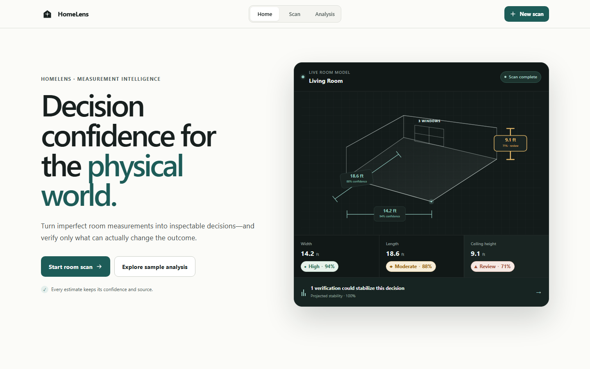
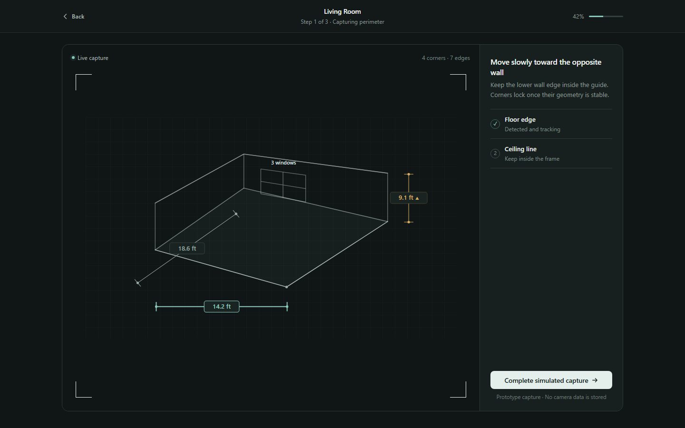
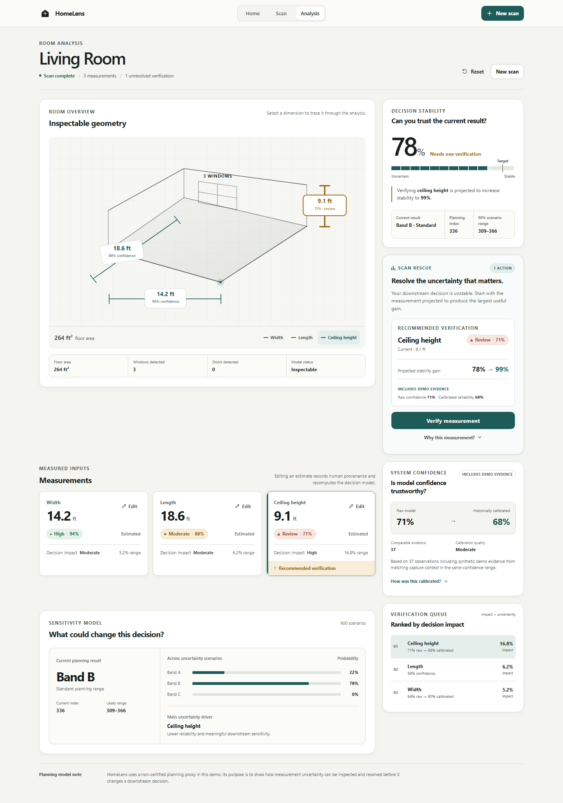

# HomeLens

**Decision confidence for physical-world software.**

Physical-world measurements are imperfect. HomeLens determines which uncertainty can actually change a downstream decision, then asks a human to verify only what matters.

[](https://github.com/JosvierR/HomeLens/actions/workflows/ci.yml)

## Live demo

**[https://homelens-kappa.vercel.app](https://homelens-kappa.vercel.app)**

No account and no secrets required. Capture is simulated.

```powershell
npm ci
npm run dev
```

Open [http://127.0.0.1:3000](http://127.0.0.1:3000). Node.js 22+.







## Why this exists

Software that measures the physical world fails differently from ordinary CRUD software. Camera angle, occlusion, lighting, calibration, and geometry ambiguity can all produce plausible-looking but imperfect inputs.

A system can be “confident enough” at the measurement layer and still unstable at the decision layer. HomeLens treats **decision stability** as a first-class product primitive.

## What is technically interesting

A low-confidence input is not automatically the most important input. HomeLens scores each measurement by both:

1. **uncertainty** — how far the observed value could plausibly move
2. **decision sensitivity** — how much that movement changes the downstream planning output

Scan Rescue then asks for the smallest useful human verification. After a person confirms a value, HomeLens keeps the original estimate, records observed error and decision impact as evidence, and optionally calibrates future confidence. Raw model confidence is never overwritten.

```text
Capture
  → measurement + provenance
  → raw confidence
  → calibration (or raw fallback)
  → decision confidence
  → Scan Rescue
  → human verification
  → ground-truth evidence
  ↺ calibration
```

The calibration loop is a **data flywheel hypothesis**, not a proven business moat. See [docs/MOAT.md](docs/MOAT.md).

## What this repository contains

- Nuxt 4 app with simulated capture, analysis, and inline verification
- strict server-validated `RoomScan` contracts (Zod)
- original-estimate / accepted-value / verification provenance
- deterministic uncertainty scenarios and bounded decision stability
- impact-aware verification ranking and adaptive Scan Rescue
- Ground Truth Calibration with ten confidence buckets and minimum-sample fallbacks
- replaceable in-memory `EvidenceRepository`
- privacy-restricted analytics allowlist (no analytics vendor is connected)
- unit tests, live API QA, and browser/responsive/accessibility checks

Core math lives in `shared/` and has no Vue or Nitro dependency.

```text
app/        UI, composables, interaction state
server/     validated HTTP APIs, demo evidence, repository adapter
shared/     domain contracts, decision engine, rescue, calibration, analytics
tests/      deterministic domain and contract tests
docs/       architecture, validation, security, and moat documentation
```

## Run and verify

```powershell
npm ci
npm run dev
```

```powershell
npm run test
npm run typecheck
npm run build
npm run qa:api      # requires the dev server
npm run qa:visual   # Chrome DevTools harness on Windows
```

CI on GitHub Actions: Node 22, `npm ci`, test, typecheck, build.

PostHog is optional. If `NUXT_PUBLIC_POSTHOG_KEY` is empty, the app still runs.

## Intentionally not implemented

- **Not** Manual J, certified HVAC sizing, or professional engineering recommendations
- **Not** a real AR/LiDAR camera pipeline — capture is simulated and stores no imagery
- **Not** production-trained calibration — the 72-record history is synthetic demo evidence
- **Not** durable storage, auth, or multi-tenant evidence persistence

The included planning index is an illustrative prototype rule. Do not use HomeLens to size real equipment.
