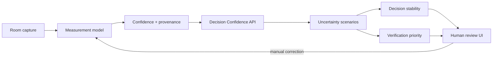

# HomeLens

**Decision confidence for software that measures the physical world.**

HomeLens is an experimental full-stack product for turning imperfect room measurements into an inspectable decision model. Instead of displaying a confidence score and moving on, HomeLens asks a more operational question:

> **Which uncertain input should a human verify first because it can actually change the decision?**

The current prototype simulates a room scan, preserves measurement provenance, propagates measurement uncertainty through a downstream planning model, and generates a ranked verification queue based on expected decision impact.

## Why this project

Physical-world software has a different failure mode from ordinary CRUD software. Camera angle, occlusion, lighting, device capability, calibration, geometry ambiguity, and user behavior can all produce plausible-looking but imperfect inputs.

A system can therefore be "confident enough" at the measurement layer while still being unstable at the decision layer.

HomeLens treats **decision stability** as a first-class product primitive.

## What is implemented

- Nuxt 4 application shell
- TypeScript domain model
- simulated room-capture flow
- editable measurements with provenance (`estimated` / `manual`)
- per-measurement confidence
- server-side Zod validation
- deterministic uncertainty simulation
- downstream planning-band distribution
- decision stability score
- impact-aware human verification queue
- reproducible pure decision engine
- unit tests with Vitest
- GitHub Actions CI
- PostHog-ready runtime configuration

## The core idea: impact-aware verification

A low-confidence input is not automatically the most important input.

HomeLens scores each measurement using both:

1. **uncertainty** — how much the observed value could plausibly move
2. **decision sensitivity** — how much that movement changes the downstream planning output

This produces a ranked human-review queue.

Example:

```text
Ceiling height
confidence: 71%
expected decision impact: 8.4%
priority: #1

Width
confidence: 94%
expected decision impact: 4.1%
priority: #3
```

If the user manually verifies ceiling height, HomeLens preserves that provenance, raises confidence to 100%, reruns the scenario model, and updates recommendation stability.

## Architecture



### Stack

- **Nuxt 4**
- **Vue 3**
- **TypeScript**
- **Tailwind / Nuxt UI**
- **Nitro server API**
- **Zod** for runtime contracts
- **Vitest**
- **GitHub Actions**
- **PostHog-ready configuration**

## Run locally on Windows

Prerequisite: Node.js 22+.

```powershell
npm install
npm run dev
```

Open:

```text
http://127.0.0.1:3000
```

Verify the project:

```powershell
npm run test
npm run typecheck
npm run build
```

## Repository structure

```text
app/
  components/
  composables/
  pages/
  types/
server/
  api/
shared/
  decision-confidence.ts
tests/
docs/
.github/workflows/
```

The decision engine lives in `shared/` so the contract can be reused by server routes, tests, and future clients without coupling the core logic to Vue components.

## Product principles

1. **Uncertainty is data.** It should survive the pipeline.
2. **Provenance matters.** A model estimate and a human-verified value are not the same thing.
3. **Verify by impact, not anxiety.** Human attention should go where it can change an outcome.
4. **Recommendations need stability, not just point estimates.**
5. **Physical-world systems need graceful escalation to humans.**
6. **Heuristics must be labeled honestly.**

## Next build targets

### 1. Scan Rescue

Detect an unstable downstream decision and ask for only the minimum additional measurement needed to stabilize it. This turns human review into an adaptive workflow instead of a static checklist.

### 2. Whole-home uncertainty graph

Represent rooms, equipment, envelope assumptions, and electrical constraints as a dependency graph. When one input changes, show which downstream decisions are invalidated.

### 3. Contractor review mode

Allow a reviewer to approve, correct, or reject individual assumptions without restarting the entire home assessment.

### 4. Product analytics

Instrument:

- `scan_started`
- `scan_completed`
- `decision_unstable`
- `verification_requested`
- `measurement_manually_verified`
- `decision_stabilized`
- `analysis_viewed`

### 5. Native capture proof of concept

Create a small SwiftUI + ARKit/LiDAR client that emits the same `RoomScan` contract used by the web application.

## Important engineering disclaimer

The planning index included in this repository is deliberately illustrative. **HomeLens does not implement Manual J, does not provide a certified HVAC load calculation, and must not be used to size real HVAC equipment.**

The technical contribution of this prototype is the uncertainty propagation, decision-stability, and human-verification layer around physical-world inputs.

## Status

Active prototype. The current milestone is to move from a single-room demo to an adaptive **Scan Rescue** workflow that requests the smallest amount of additional human input required to stabilize a downstream decision.
