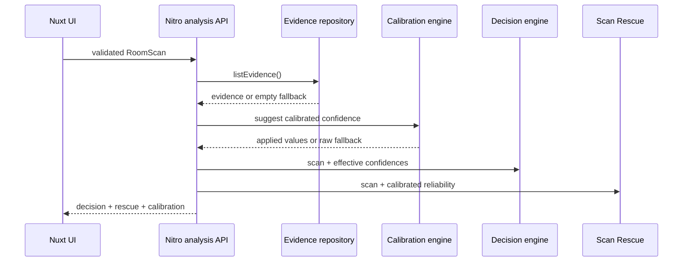
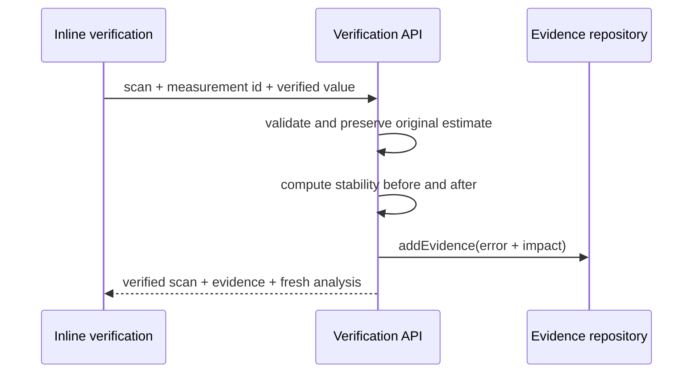

# Architecture

## Domain boundaries

### Capture

Produces observations and capture context. It does not own decision or calibration logic. The current web flow is simulated and stores no imagery.

### Measurement

A measurement separates current accepted state from historical origin:

- `value`, `confidence`, `source`: current accepted state;
- `originalEstimate`: immutable model value and confidence;
- `rawConfidence`: original model output retained after verification;
- `calibratedConfidence`: optional presentation field, never a replacement for raw confidence;
- `verification`: timestamp, source, and previous accepted state.

### Calibration

`shared/calibration.ts` is a pure module that records derived error, creates ten confidence buckets, calculates an ECE-inspired quality metric, and suggests calibrated confidence through minimum-sample context fallbacks.

### Decision confidence

The pure engine receives a validated scan plus optional confidence overrides. It produces deterministic scenario distributions, `0..1` stability, and an impact-aware queue. It never mutates the scan or raw model confidence.

### Scan Rescue

Rescue greedily simulates each remaining manual verification, chooses the greatest positive stability gain, and repeats until the target is reached or no useful action remains. Manual measurements are excluded.

### Persistence

`EvidenceRepository` defines asynchronous `listEvidence`, `addEvidence`, and `findComparableEvidence` methods. `InMemoryEvidenceRepository` is the prototype adapter. A durable adapter can replace it without changing shared math.

### Analytics

The analytics interface accepts typed events and an allowlisted set of non-sensitive properties. The current runtime stores only ephemeral, sanitized events and sends nothing externally.

## Request paths

## Failure isolation and performance

- Calibration errors and repository-read failures return raw-confidence analysis.
- Invalid requests return a stable JSON error object and never enter the engine.
- Client analysis is debounced, previous requests are aborted, and stale responses are ignored.
- A consolidated analysis endpoint prevents three separate client simulations per edit.
- The engine is deterministic for identical input, sample count, and confidence overrides.

## Prototype limitations

The planning bands, uncertainty spread, tolerance, and synthetic evidence are illustrative. There is no durable storage, account boundary, camera ingestion, certified load model, or statistically validated production calibration dataset.
