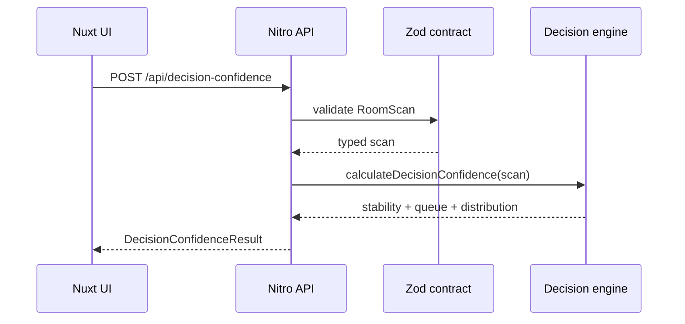

# Architecture

## Goal

HomeLens explores a narrow systems problem: how to keep imperfect physical-world measurements from silently turning into brittle downstream decisions.

## Domain boundaries

### Capture

Responsible for producing observations: dimensions, openings, equipment, images, and future geometry. Capture may eventually be native (ARKit/LiDAR) or model-assisted, but it does not own downstream decision logic.

### Measurement model

Every measurement contains numeric value, unit, confidence, and provenance (`estimated` or `manual`). Human correction changes provenance instead of silently replacing history.

### Decision confidence

A pure TypeScript engine receives a validated `RoomScan`, generates deterministic uncertainty scenarios, evaluates decision-band stability, and ranks potential human verifications by expected impact.

### Review

The UI makes uncertainty inspectable and gives the user a direct path to correct the highest-value input first.

## Request path

## Why a pure engine

The decision algorithm is kept free of Vue/Nitro dependencies so it can be unit tested quickly, run in worker jobs later, shared with another client, calibrated against real measurement-error datasets, and replaced without rewriting the product UI.

## Current model

The demo uses a deliberately simple planning index and three illustrative decision bands. This is not intended to model actual HVAC sizing.

The valuable architecture is the wrapper:

`measurement -> uncertainty -> downstream sensitivity -> stability -> human verification`

## Production evolution

A stronger production implementation would add persistent scan/revision records, calibrated uncertainty distributions by device/capture modality, a dependency graph across rooms and systems, audit logs for human overrides, async CV/geometry jobs, role-based review workflows, PostHog instrumentation, and structured observability around model and human disagreement.
