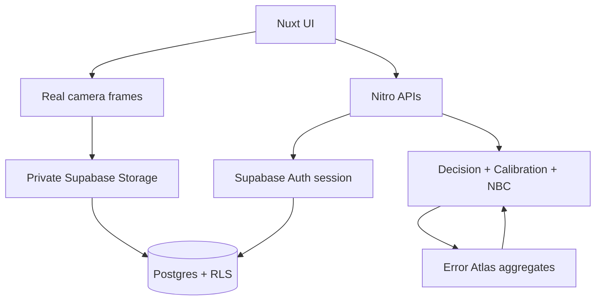

# Architecture

## Product modes

- **Demo** — anonymous, synthetic/local scan, no permanent Storage.
- **Product** — authenticated Supabase persistence, private evidence, learning loop.

## Domain boundaries

### Capture

Browser camera (`useCamera`) collects useful frames after intentional permission.
Local quality heuristics and EXIF-stripping canvas normalize frames.
Camera evidence does **not** invent certified dimensions.

### Measurement

Accepted state is separate from immutable `original_estimate` / `raw_confidence`.

### Calibration / Error Atlas

Pure math in `shared/calibration.ts`.
Durable evidence via `verification_evidence` + profile aggregates.
Service: `server/services/error-atlas.ts`.

### Decision confidence

Unchanged deterministic engine in `shared/decision-confidence.ts`.

### Scan Rescue + Next Best Capture

Rescue ranks verifications.
`shared/next-best-capture.ts` ranks additional capture targets with a transparent utility formula and an explicit STOP rule.

### Persistence

```text
Browser
  → Nuxt UI + Camera
  → Private Supabase Storage (scan-evidence)
  → Nitro APIs (session via @supabase/ssr cookies)
  → Postgres + RLS
  → Decision / Calibration / Next Best Capture engines
```



## Client packages

- `@supabase/ssr` — browser + Nitro cookie sessions (official SSR guidance)
- `@supabase/supabase-js` — Storage upload/download helpers

Publishable key only in `NUXT_PUBLIC_*`.
Secret key optional server-only for privileged jobs.

## Prototype limitations that remain

Planning bands and tolerances are illustrative.
Camera frames are evidence, not a validated CV measurement pipeline.
Local Supabase requires Docker Desktop; remote project must be linked for production.
