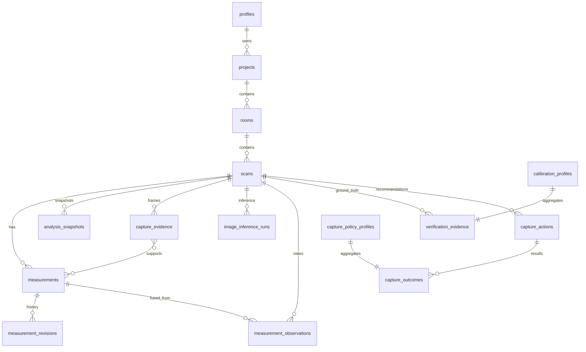

# Database

HomeLens persists real product state in Supabase Postgres with Row Level Security.

## Entities



## Ownership

Every user-owned table includes `user_id`.
Policies require `auth.uid() = user_id` for SELECT/INSERT/UPDATE/DELETE.
A trigger rejects inserts/updates that spoof another `user_id`.

## Storage

Private bucket: `scan-evidence`

Path:

`{user_id}/{project_id}/{scan_id}/{capture_evidence_id}.{ext}`

Storage RLS allows authenticated users only under their own `user_id` prefix.

Upload mode (v1): authenticated direct upload via `@supabase/supabase-js` under RLS.
Signed read URLs are generated on demand and never stored.

## Evidence origin

`evidence_origin` isolates:

- `synthetic_demo` — demo seed / local in-memory only
- `real_user_verification` — production learning default
- `internal_test` — CI / local integration

Production calibration defaults to `real_user_verification`.

## Photo-metric tables

`image_inference_runs` stores per-view depth/structure status, model versions, quality scores, and processing time. Depth arrays stay out of Postgres.

`measurement_observations` stores one row per view-level width/length/height observation, including uncertainty and geometry residual.

Fused `measurements` add `measurement_method`, original vs accepted values, raw vs calibrated confidence, uncertainty bounds, supporting view count, and model versions.

## Model versions

Rows persist:

- `measurement_model_version`
- `depth_model_version`
- `structure_model_version`
- `geometry_model_version`
- `confidence_model_version`
- `decision_model_version`
- `calibration_version`
- `capture_policy_version`

Pinned in `shared/model-versions.ts`.

## Migrations

```powershell
npx supabase migration new <name>
npx supabase db reset   # local, requires Docker Desktop
npx supabase db push    # linked remote project
```

## Retention / deletion

Deleting a project removes Storage objects for that project, then cascades DB rows.
Account deletion must remove auth user + owned data (server-only privileged path).

## Indexes

Created for real access paths: `(user_id, created_at)`, `scan_id`, measurement type + model version, capture action ids.
